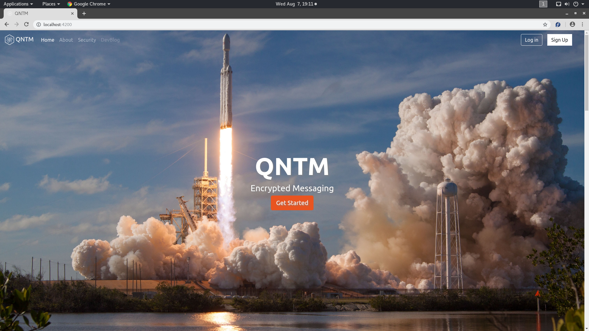
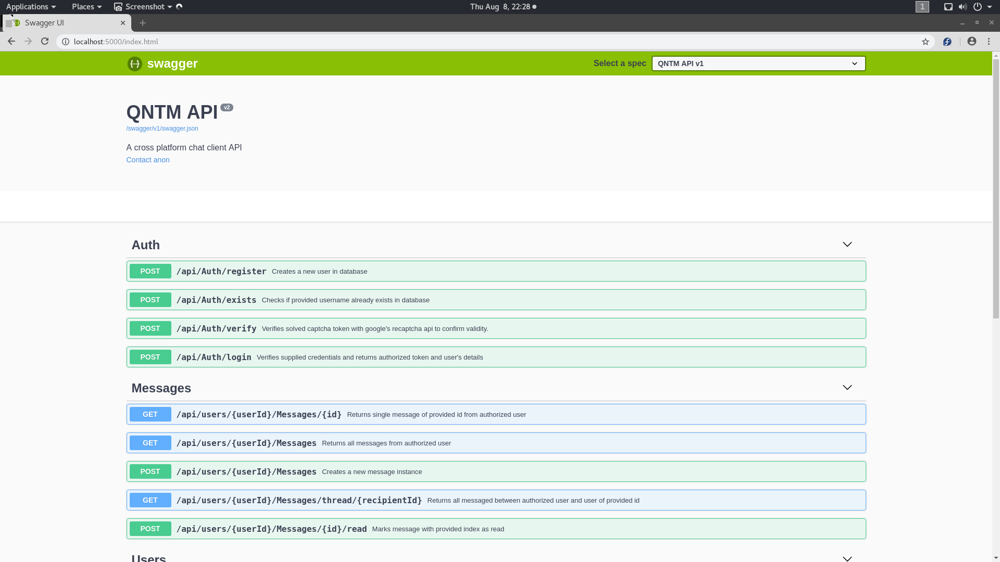
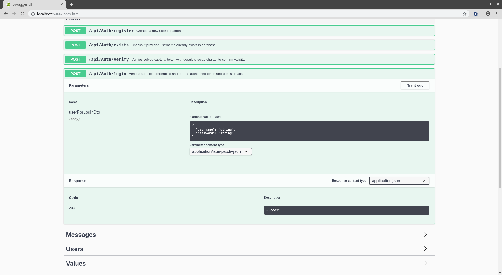
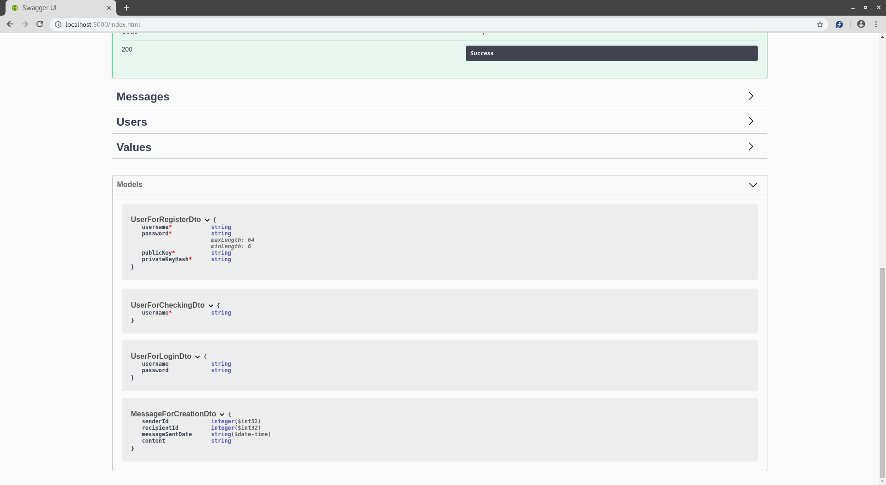

# QNTM Backend API
The backend for all current versions of QNTM Chat.

## Overview
* This is a ASP.NET Core Web API project
* Powers multiple front ends
* Zero knowledge encryption
* Code-First database design
* Uses Swagger for documentation
  
## Front-Ends
[Angular 6 SPA](https://github.com/NicholasDollick/QNTM-Ang)

[WPF Desktop App](https://github.com/NicholasDollick/QNTM-WPF)

## Documentation Examples

